# Part 2: App.js workshop

## Topics

High overview of the topics covered in this part of the workshop:

- Create and use a development client from the cloud
- How to publish an app to the Apple App Store without having any tools installed
- Using EAS Metadata to automate and maintain your app store presence from the command line
- Over-the-air updates (OTAs) with EAS Update

## Development clients

### What is a development client?

- Introduced in 2021 to solve limitations of Expo Go
- Contains a popular Expo Go experience and some features
- It's like creating your own Expo Go client that is unique to your project
- You can install any third-party library that requires custom native code
- Allows using custom config plugins or native modules seamlessly in your project
- During development, it helps to iterate quickly to achieve web-like iteration
- Allows sharing the native runtime with your team
- Reduced bundled size of the app
  - Expo Go as a client is bundled with Expo SDK and APIs
  - Development client is not, you can pick any API from the SDK and add it to your app
  - The `expo` package size only adds 1 MB one time to the final app size & has a marginal size cost. For example, adds only 150 Kib on Android. The rest comes from language such as Kotlin on Android.

### What are development clients made of?

Like Expo Go, a development client divides your app into two parts
- **Native runtime**: A native binary built with Android Studio or Xcode. For example, Expo Go.
- **An update**: Bundle of your JavaScript code and assets. This can be served locally by Expo CLI through your computer (just like in Expo Go).

Development clients further allow you to take advantage of Expo tools and services (Expo SDK APIs and EAS services -- build, submit, update, etc.) without having to install any tools on your computer.

### Ways to create a development client

<!-- Remove the prebuilding part out of it -->

<!-- 1. **Locally**  `npx run:android|ios`
- Requires Android Studio or Xcode installed on your machine to compile and generate the native runtime and install a development client. -->

 On the cloud using EAS Build (also known as Development builds (debug builds))
- Doesn't require Android Studio or Xcode installed on your machine.
- We will look into this method in the steps below.

### Step 1: Prepare React Native app to create a development client

> **Note:** Prerequisite: npx install-expo-modules@latest (need to have Expo modules installed)

Let's prepare the development client to create a debug build that can be used in the development phase of the app.

1. To create a development build, install `expo-dev-client` library:

```sh
npx expo install expo-dev-client
```

> **Note:** If your project has **ios** directory, install the native code for `expo-dev-client` (skip this step if your project doesn't have **ios** directory):
>
> `npx pod-install`

`expo-dev-client` is a library designed that supports any workflow, release process, or set of dependencies in the Expo/React Native ecosystem.

2. Configure deep link support for your app

2.1 Development builds use deep links to open projects from QR code.

2.2 To enable deep link support, add `scheme` in field in your **app.json**:

```jsonc
{
  "expo": {
    // ...
    "scheme": "your-app"
  }
}
```

- `scheme` is required when creating standalone apps or production apps.
- It's a URL scheme to link into your app (and is the same string used when deep linking).

> **Note:** If you have native directories (**android** or **ios**), use `npx uri-scheme` to add `your-scheme`.

3. Update the `start` script in `package.json`:

```jsonc
{
  "scripts": {
    "start": "npx expo start --dev-client",
  }
}
```

When you're developing your app, to start the development server, you need to use `--dev-client` flag with `npx expo start command`. This will start the development server and open your project in your development client.

### Step 1.1 (optional): Migrate native customizations

If your project has any native modifications (changes to the **android** or **ios** directories, such as app icon configuration or splash screen), then you'll need to configure your app config (`app.json`) and other entry files to reflect those native changes.

1. Update entry file - Modify the entry file to use `registerRootComponent` instead of `AppRegistry.registerComponent` in `index.js`:

```js
import {registerRootComponent} from 'expo';

import App from './App';

// registerRootComponent calls AppRegistry.registerComponent('main', () => App);
// It also ensures that whether you load the app in Expo Go or in a native build,
// the environment is set up appropriately
registerRootComponent(App);
```

It sets the initial React component to render natively in your app's root React Native view.

2. Update `metro.config.js` file:

```js
// Learn more https://docs.expo.io/guides/customizing-metro
const {getDefaultConfig} = require('expo/metro-config');

module.exports = getDefaultConfig(__dirname);
```

Expo CLI uses Metro bundler during `npx expo start` to bundle JavaScript code and assets.

3. Add **android** and **ios** directories **.gitignore**. This step is required to avoid conflicts with the native code generated by EAS Build. In some cases, the config plugins might not work if you have existing native code in **android** and **ios** directories.


4. Since you are using config plugins, you can safely add backup native directories to **.gitignore** file to prevent them from being committed to your repository.

5. Update **app.json***

Add top-level `expo` object in **app.json** and remove all fields outside of it:

```jsonc
{
  "expo": {
    "name": "Expo Appjs Workshop",
    "slug": "workone",
    "scheme": "workone",
    "ios": {
      "bundleIdentifier": "com.workone.app"
    },
    "android": {
      "package": "com.workone.app"
    }
  }
}
```

Adding `name` and `slug` is mandatory. The `android.package` and `ios.bundleIdentifier` are unique identifiers that will be used in your standalone apps.

6. If you have an app icon or a splash screen, you can define paths to those local assets in `expo.icon` and `expo.splash`.

```jsonc
{
  "expo": {
    // ...
    "icon": "./assets/icon.png",
    "splash": {
      "image": "./assets/splash.png",
      "resizeMode": "contain",
      "backgroundColor": "#ffffff"
    },
}
```

> Use [Expo Tools VSCode extensions](https://marketplace.visualstudio.com/items?itemName=byCedric.vscode-expo) to introspect your app config. It helps you identify issues with your config file before creating a development client.

### Step 2: Configure the project for a development client

In this step, let's create and install a development client using EAS Build.

> EAS Build is a serves that helps building app binaries for your Expo and React Native projects. It is a part of Expo Application Services (EAS).

1. Install EAS CLI globally on your machine and log-in to your expo account:

```sh
# outside your project directory
npm install -g eas-cli && eas login
```

2. Configure the project for EAS Build

To initialize your project on EAS services (create an EAS project in your Expo account) and create a configuration file called **eas.json**:

```sh
eas build:configure
```

The generated **eas.json** with the following content:

```jsonc
{
  "cli": {
    "version": ">= 3.10.2"
  },
  "build": {
    "development": {
      "developmentClient": true,
      "distribution": "internal"
    },
    "preview": {
      "distribution": "internal"
    },
    "production": {}
  },
  "submit": {
    "production": {}
  }
}
```

- It contains three different `build` profiles: `development`, `preview` and `production`.
- A build profile is a named grouping of configurations that describes the necessary parameters to perform a certain type of build.
- For example, right now, we are interested in creating a development build. So the profile we are interested in is `development`.
- By default, **eas.json** creates three build profiles for three different purposes: `development`, `preview` (for example, Internal distribution via TestFlight) and `production`.
- [Each build profile is customizable and you can create your own.](https://docs.expo.dev/build/eas-json/)

#### What is `projectId` in `app.json`?

When `eas build:configure` command runs, it also associates a unique identifier for your project in `app.json` under `extra.eas.projectId`. This is used to identify your project on EAS servers.

```jsonc
{
  "expo": {
    // ...
    "extra": {
      "eas": {
        "projectId": "0cd3da2d-6148-4071-b6db-fdc55b17f274"
      }
    }
  }
}
```

### Step 3: Create a development build for emulator/simulator

To create a development build for the Android emulator and/or iOS simulator will help you install the development client:

1. Create a development build for Android emulator

```sh
eas build --profile development --platform android
```

2. For iOS, define a build profile called `sim` in **eas.json**:

```jsonc
// add the following after "development"
"sim": {
      "extends": "development",
      "ios": {
        "simulator": true
      }
    },
```

The `extends` help you to inherit the configurations from an already defined build profile. In above example, custom build profile `sim` inherits the configurations from `development` profile.

3. Create a development build for iOS simulator

  ```sh
  eas build --profile sim --platform ios
  ```

- While the build is in progress, EAS CLI provides a link to the Build progress in the CLI:

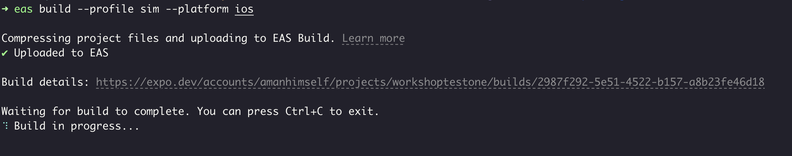


You can view this link to see what steps are being performed during the build process.

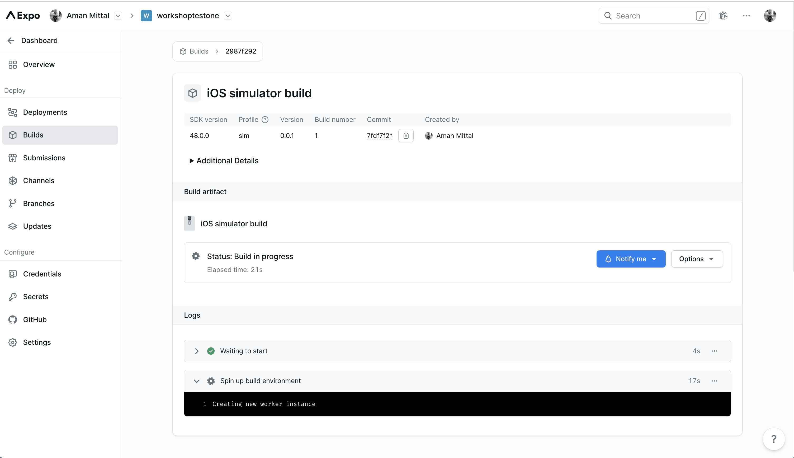

Each build has a unique `Build ID`, and each project has a `project ID` which is a unique identifier for your project on EAS services.

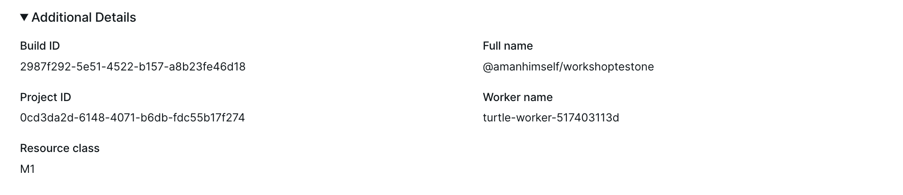

Whenever either of the build completes, EAS CLI will ask you to install them on the emulator/simulator. Press `Y` to accept it and it will directly install on the emulator/simulator.

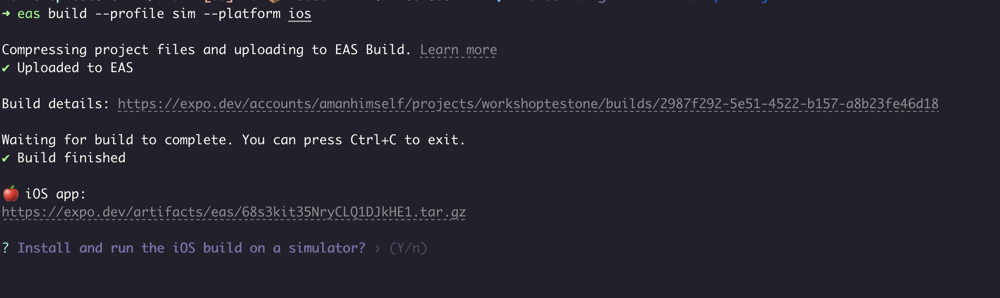

### (Optional) Create and install a development client on a device

1. For Android, you need to create a **.apk**

```sh
eas build --profile development --platform android
```

2. For iOS, you need a paid Apple Developer account. then

2.1 To register your iOS device you'd like to develop onto your ad hoc provisioning profile:

> Apps signed with an ad hoc provisioning profile can be installed by any iOS device whose unique identifier (UDID) is registered with the provisioning profile.

```sh
eas device:create
```

2.2 After registering your device, create a development build for iOS device:

```sh
eas build --profile development --platform ios
```

> Don't use `sim` or simulator profile. It will not work on a real device.

> Devices running iOS 16 and above require enabling a special OS-level Developer Mode to install development builds. If you don't have this setting enabled or are installing your first development build on your device, see [iOS Developer Mode](https://docs.expo.dev/guides/ios-developer-mode/) to enable it.

- After the build is complete, you can download it on your iOS device by scanning the QR code from the device's camera from the Expo CLI. The QR code is provided when the eas build command has finished running.

### Step 4: Use a development client

#### Launcher screen

1. Open the development client on your emulator/simulator or device.

2. You will see a launcher screen. You can also log-in to your Expo account from this screen.

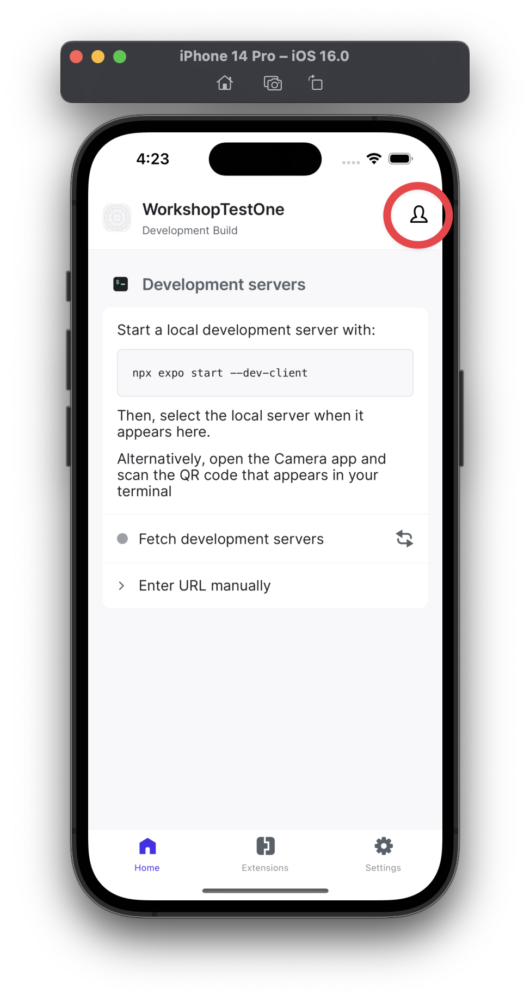

#### Start development server

1. To start developing, in your project's root, run the development server:

```sh
yarn start
```

2. When you are logged in, click "Fetch development servers" and it will fetch the development server URL from your machine.

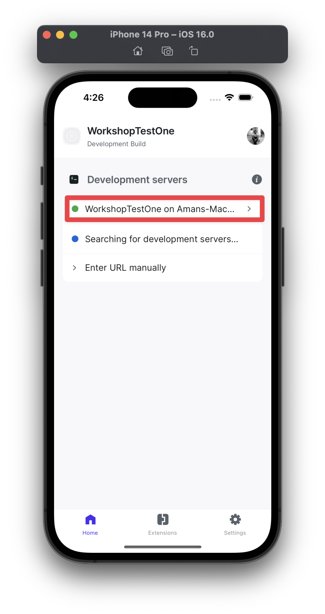

- The development server URL on your machine (deep link) is used to connect the development client to the development server running on your machine.
- When you run `yarn start` after the QR code, you will see a similar URL that starts with your app's `scheme`:

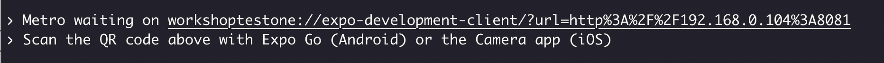

> 🎉 Congratulations! You have created your first development client on cloud, connected it to your development server running on your machine and installed it on your emulator/simulator or device.

#### (Optional) Share with your team

When a development build is ready, a shareable URL is generated for your build with instructions on how to get it up and running. You can use this URL with a teammate or send it to your test device to install the build. The URL generated is unique to the build for your project.

- Using URL from EAS CLI


- Using Expo Dashboard


#### Reading logs in Expo dashboard

Logs for each build contain a multitude of steps that are performed in a sequence during the build process. You can view these logs in the Expo dashboard for each build (whether development, preview or production).

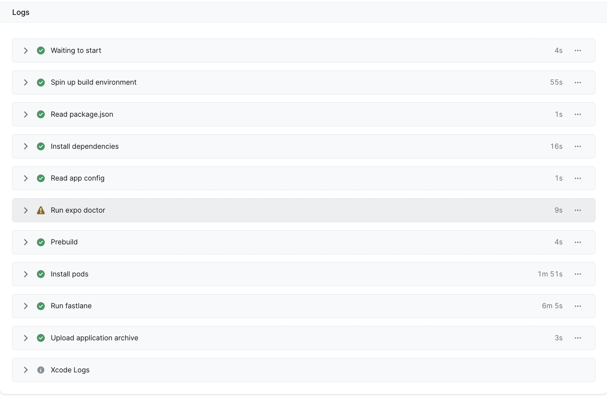

Generally, a log contains the following steps:
- Spin up the EAS Build builder (worker)
- Read package.json
- Install dependencies from `package.json`
- Read app config from `app.json`
- Run expo doctor to check all dependencies are okay and there are no errors or incompatible versions (it will give warnings in case of incompatible versions)
  - You can also use `npx expo install --fix` any time in your project to review and upgrade dependencies
- Prebuild (generate native code)
- Install pods (only for iOS)
- Run gradlew (for Android) or run fastlane (for iOS)
- Upload application archive so that you can download it from EAS servers

### Additional Resources

- Learn more about [Creating development builds](https://docs.expo.dev/develop/development-builds/create-a-build/) and [Using development builds](https://docs.expo.dev/develop/development-builds/use-development-builds/) on EAS Build.
- [Build profiles in eas.json](https://docs.expo.dev/build/eas-json/#)
- In case of multiple builds, see how to use `eas build:run` command for [Android](https://docs.expo.dev/build-reference/apk/#emulator-virtual-device) and [iOS](https://docs.expo.dev/build-reference/simulators/#installing-build-on-the-simulator) to select and install the build using EAS CLI.
- Learn more about [Android](https://docs.expo.dev/build-reference/android-builds/) or [iOS](https://docs.expo.dev/build-reference/ios-builds/) build process
- [eas.json schema reference](https://docs.expo.dev/build-reference/eas-json/)
- [Troubleshooting build errors and crashes](https://docs.expo.dev/build-reference/troubleshooting/)
- [Learn how to codesign existing **.ipa** to a new ad hoc provisioning profile](https://docs.expo.dev/app-signing/app-credentials/#re-signing-new-credentials)

---

## Deploy to stores

- EAS Build allows you to build a native app binary that is signed for app store submission. These types of builds are called production builds.
- Production builds are submitted to app stores for release to the general public or as part of a store-facilitated testing process such as TestFlight.
- These builds are installed through their respective app stores. They cannot be installed directly on your Android Emulator or device, or iOS Simulator or device.

### Prerequisites

- Need a Google Play Developer membership
- Need an Apple Developer Program membership

### Step 1: Create a production build

Before submitting the binary to the app store, you need to create a production build to create that native binary.

1. **eas.json** already has a `production` profile. You can use it to create a production build.

```jsonc
{
  "build": {
    // ...
    "production": {}
    // ...
  }
}
```

2. Create a production build

```sh
# android

eas build --platform android

# ios
eas build --platform ios

# alternatively, you can use the following command
# to build for Android and iOS at the same time
eas build --platform all
```

- EAS CLI prompt for providing Apple account credentials.
- If you haven't build the app before for the app stores, let EAS CLI generate app signing credentials.
- For iOS, Providing these credentials, will help EAS CLI take care of creating a provisioning profile and distribution certificate for your app.
- For Android, EAS CLI will generate a keystore for your app.

Example of distribution certificate and provisioning profile for iOS:

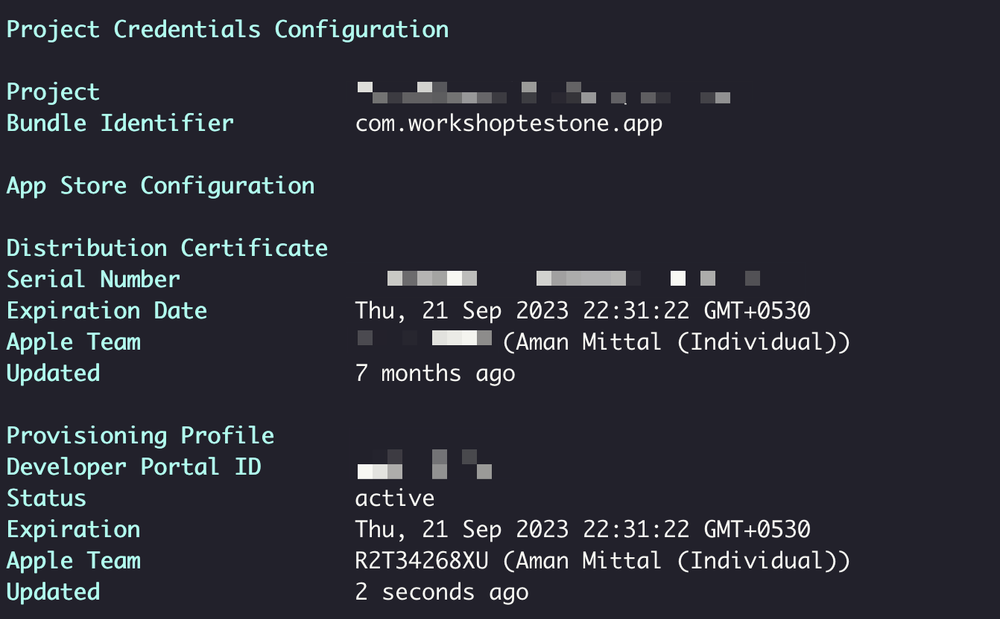

Once the build is complete, it will give a URL to download the binary. For example, when an iOS production build is complete, it gives a link to download the **.ipa** file (native binary):

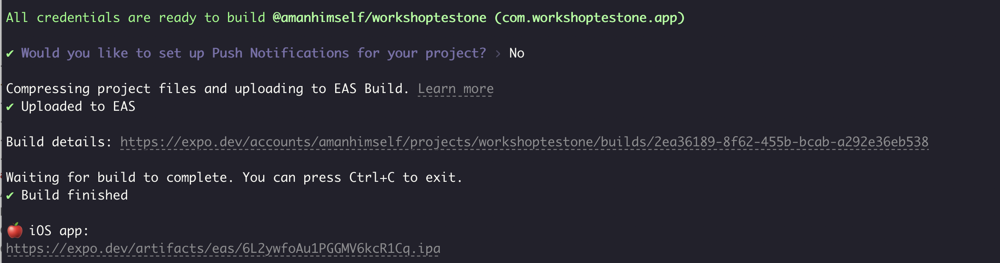

We don't have to download it. In the next section, we'll see how EAS handles uploading this native binary automatically to the app store (without us having to download it manually and then uploading it).

### Step 2: Submit app binary

#### Prerequisites

**Android**

- Requires you to create a Google Service Account and download its JSON private key. For more info, see [Creating Google Service Account](https://github.com/expo/fyi/blob/main/creating-google-service-account.md)
- Create an app on Google Play Console and upload your app (**.aab**) manually at least once.

**iOS**

- App Store Connect API Key. If you haven't generated or are submitting the app for the first time, let EAS CLI take care of it for you.

#### Steps to submit the app binary

1. To submit the binary:

```sh
# android
eas submit -p android

# ios
eas submit -p ios
```

2. When prompted for "What would you like to submit"?
- You can either choose to select the latest production build or provide path to the native binary.

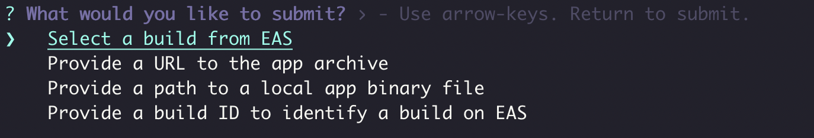

3. When the build is submitted, you will get a URL to track the progress:

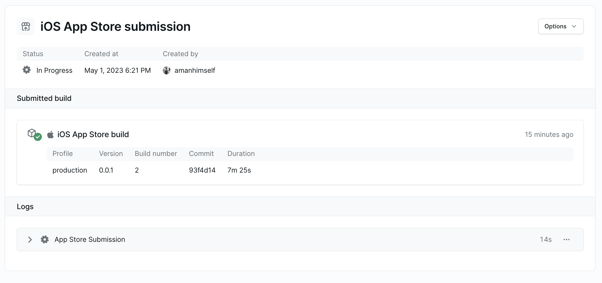

Also, the CLI will prompt if the binary submission was successful or not:

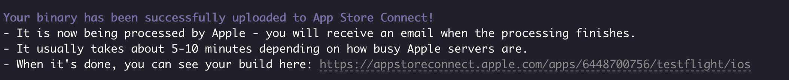

For example, when a production build is submitted to the Apple App Store, it is directly released for TestFlight testing. You can see the build in the TestFlight section of your app in App Store Connect:

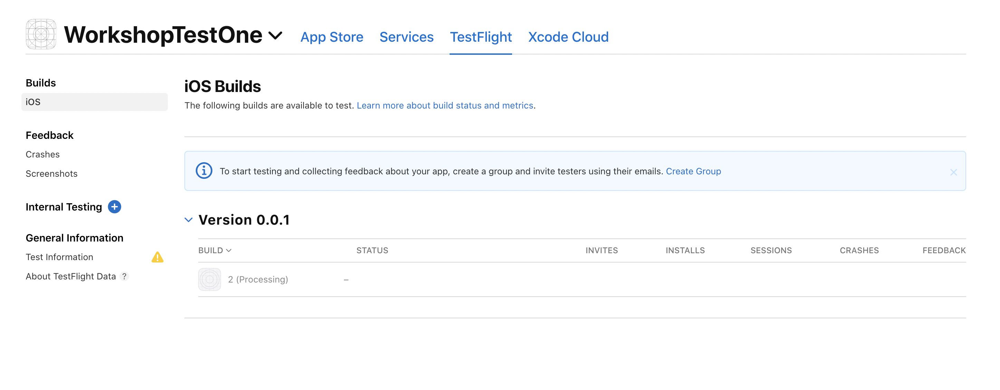

When processing is done (as shown in above screenshot), it will show a different status:

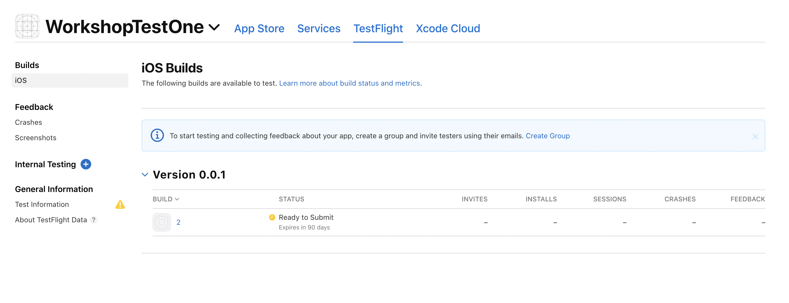

> Manually submitting native binary to the app store, requires you to open Apple App Store Connect sign-in, then create an application record. After that, you need to upload the **.ipa** with the Transporter app and follow its process. With EAS Submit, all this taken care of you.

You can always check your app submissions to different stores in the Expo dashboard:

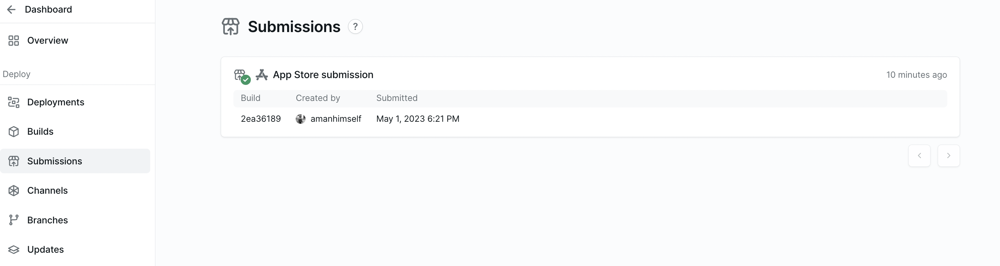

#### Wait, what is EAS Submit?

- EAS Submit is a service for uploading and submitting your app binaries to the app stores.
- Since it's a hosted service, you can submit your app to both stores as long as you can run EAS CLI on your machine.
- With EAS Build and Submit, you can automate app store submissions using the `--auto-submit` flag. This flag tells EAS Build to pass the build along to EAS Submit with the appropriate submission profile upon completion. EAS Submit will then automatically submit the build to the app store.
  - No need to create a production build again and again when you want to submit it to the app store.

```sh
eas build --auto-submit
```

---

# EAS Metadata

- When submitting your app to the app store, you need to provide various information like links to privacy policy, keywords, etc.
- Going through the review process, when the app is rejected, you need to restart this process.
- EAS Metadata enables you to automate and maintain your app store presence from the command line (without the need of doing it manually).
- It uses re-usable `store.config.json` file that holds the information you want to upload to the app stores.
- Currently, available for iOS only.

## How to use EAS Metadata

1. Create a `store.config.json` at the root of your project.

2. Add the following (as an example or modify in case of your app) snippet:

```json
{
  "configVersion": 0,
  "apple": {
    "info": {
      "en-US": {
        "title": "Workshop One",
        "subtitle": "Our self-made workshop app",
        "description": "The most worked-shop app you've ever seen",
        "keywords": ["awesome", "app", "appjs", "eas", "expo"],
        "marketingUrl": "https://example.com/en/promo",
        "supportUrl": "https://example.com/en/support",
        "privacyPolicyUrl": "https://example.com/en/privacy"
      }
    }
  }
}
```

3. Run the following command (since you already have the app in TestFlight by now -- if you've been following this example)

```sh
eas metadata:push
```

An example is shown below after running the above command for an app in TestFlight:

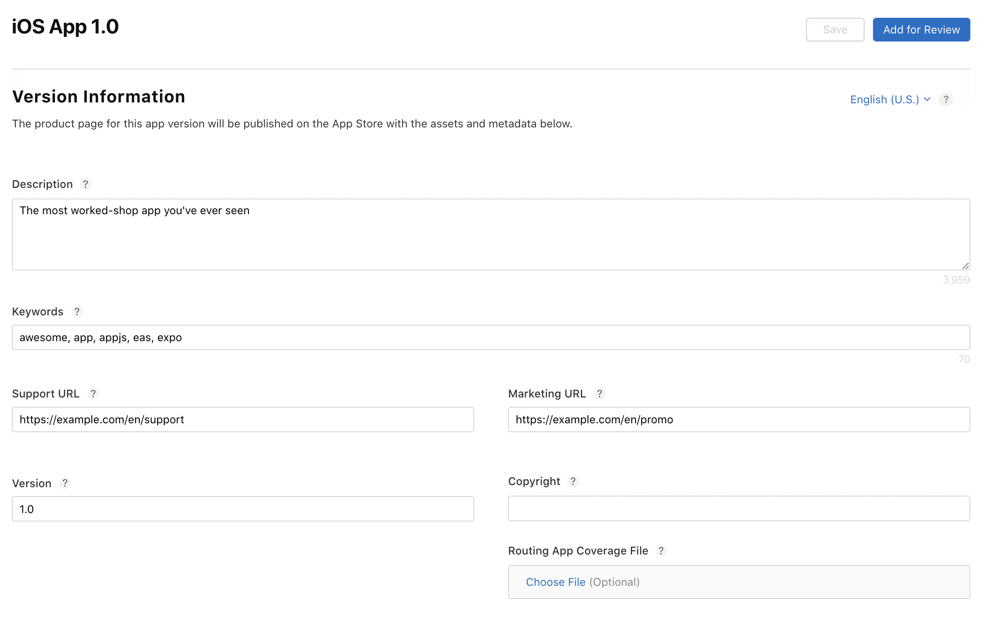


> If you already have an app in the app store, use `eas metadata:pull` to pull the info. For more info, see [EAS Metadata: Getting started](https://docs.expo.dev/eas/metadata/getting-started/).

## Additional Resources

- See [store.config.json schema](https://docs.expo.dev/eas/metadata/schema/) to learn more about what values are supported.
- [Learn how to use dynamic values](https://docs.expo.dev/eas/metadata/config/#dynamic-store-config)

---

# App version management

- EAS Build can manage automatically the version of your app.
- In a React Native app, the version for
  - Android is represented by `versionCode` in `android/app/build.gradle`
  - iOS is represented by `CFBundleVersion` in `ios/<project-name>/Info.plist`
- EAS Build uses **eas.json** to manage app versions.
- Two ways to manage app versions:
  - Remote (**recommended**): Configure **eas.json** to let EAS servers to store and manage the app version
  - Local: Managed by you locally within the source code. EAS does not write to the project, it will read the value.

> Having a duplicate build version number is one of the frequent cause of app store rejections. To fix it, you have to go back and update your app, rebuild it and resubmit to the app store. All of this can be avoided by using EAS Build to manage your app version.

Let's test it for simulator builds:

1. Open **eas.json** and the following in your `sim` profile:

```json
{
  "sim": {
    "extends": "development",
    "autoIncrement": true,
    "ios": {
      "simulator": true
    }
  },
}
```

2. Rebuild your app to see the Build Number in Expo dashboard get incremented.

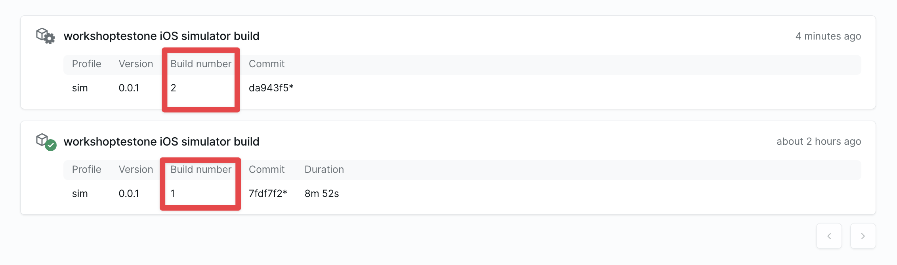


---

# OTAs with EAS Update

- EAS Update allows you to send over-the-air updates to your users' devices.
- This can be done between app store submissions.
- EAS Update is a hosted service that allows you to publish and host your updates.
- Projects need to install `expo-updates` library and configure it to use EAS Update.
- All apps running the `expo-updates` library can receive updates.
- EAS Update serves updates from the edge with a global CDN and uses modern networking protocols such as HTTP/3 for clients that support them.
- It implements the Expo Updates protocol, an open, standard specification for instant updates.
- OTAs can contain JavaScript code changes, image assets, (but no app config or native code changes are allowed).


## Install `expo-updates`

Install `expo-updates` library:

```sh
npx expo install expo-updates
```

## Configure EAS Update in your project

To configure your project, run the following command:

```sh
# initialize project with EAS Update
eas update:configure
```

After configuring your project, **eas.json** will be updated and each build profile contains a new property called `channel`:

```jsonc
{
  "build": {
    "preview": {
      "channel": "preview"
      // ...
    },
    "production": {
      // ...
      "channel": "production"
    }
  }
}
```

The next step is to create a build for the profile you want the updates to be associated with:

```sh
eas build --profile production --platform ios
```

- The `channel` allows you to point updates at builds of that profile.
  - Helps identifying different builds (preview, production, etc.)

It also modifies **app.json** to add:

- `runtimeVersion.policy`: The runtime version describes the JS–native interface defined by the native code layer that runs our app's update layer. Whenever we make changes to our native code that change our app's JS–native interface, we'll need to update the runtime version.
- `updates.url`: To serve the updates using [modern manifest protocol](https://docs.expo.dev/technical-specs/expo-updates-1/).

```jsonc
{
  "runtimeVersion": {
    "policy": "sdkVersion"
  },
  "updates": {
    "url": "https://u.expo.dev/b6db-fdc55b17f274"
  }
}
```

- It creates a link between the build and the update.
- Creating another build is required because we've to make sure that the update can run on that build.


You can now make changes locally.

## Publish an update

To publish an update:

```sh
eas update --branch [branch] --message [message]
```

- The `branch` is defined by you. For example, if you're publishing an update for the `preview` build profile, you can point it to the `preview` branch. (All default build profiles have default branches created).
  - In Expo dashboard, you can view all the branches:

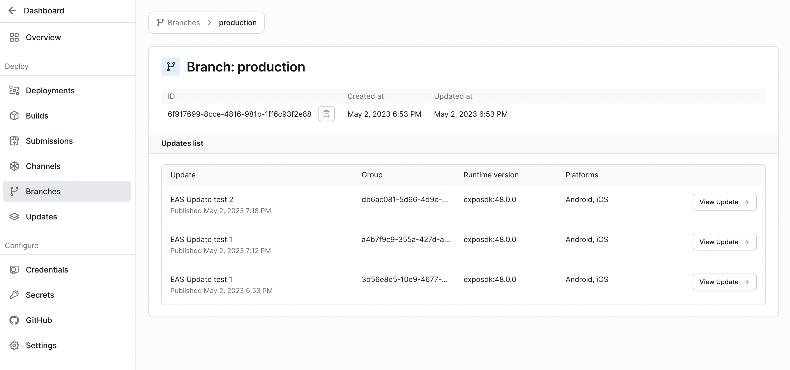

- The `message` is a description of the update.
- Once the update is built, it's uploaded to EAS and the command completes:

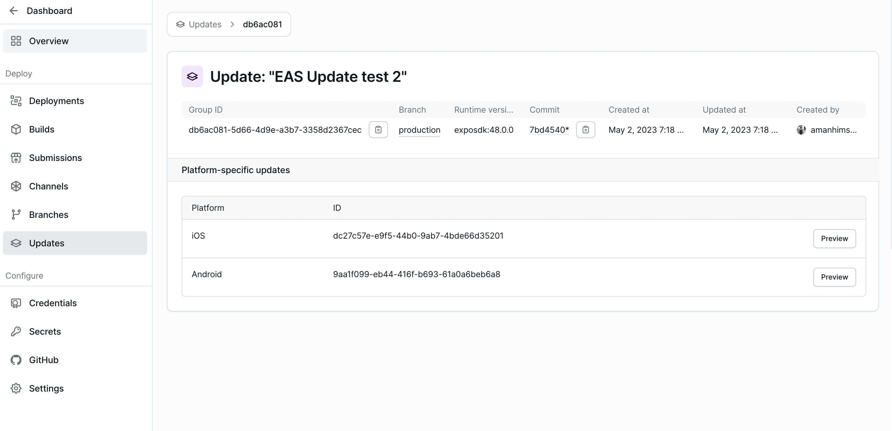

- Once these steps are complete, all users running your app will receive the update with your changes.
- By default, expo-updates checks for updates in the background when an application launches, and this behavior is configuration.
- To test the update, force close and reopen your app two times to download and view the update.


### What makes an update compatible with a build?
- platform of the build and update must match
- runtime version also must match for build and update
- the channel on the build must be linked to that branch where the update exists (you can change that with eas:edit)
- update must be newer than the build (this trips people most)

### Additional resources
- [Introduction to EAS Update](https://docs.expo.dev/eas-update/introduction/)
- [How EAS Update works](https://docs.expo.dev/eas-update/how-eas-update-works/)

---

## Resources

- Check out [Expo docs for more information](https://docs.expo.dev/) on Config plugins, Prebuild, EAS Build, Submit, Update, etc.
